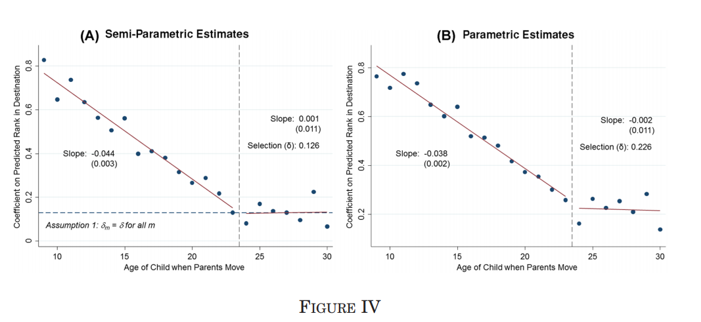
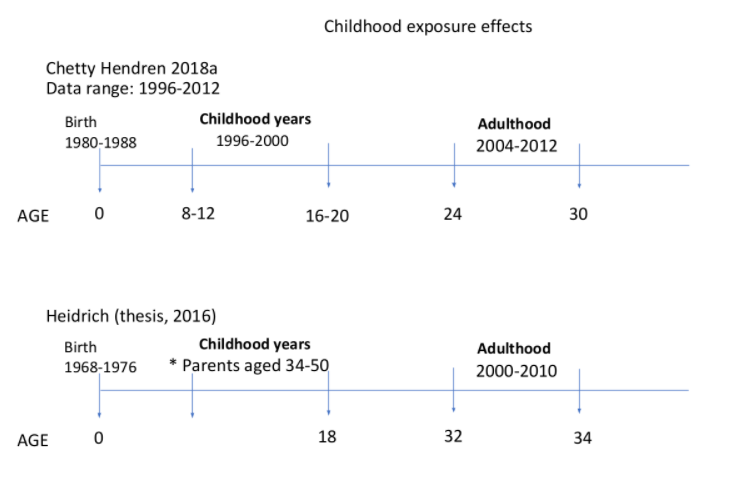

---
html:
  embed_local_images: true
  embed_svg: true
  offline: true

print_background: false
---

# chetty-hendren-Nordic README
Notes on replication of the Chetty and Hendren (C+H) design for LATF project

<!-- TOC titleSize:2 tabSpaces:2 depthFrom:1 depthTo:6 withLinks:1 updateOnSave:1 orderedList:0 skip:0 title:1 charForUnorderedList:* -->
## Table of Contents
* [chetty-hendren-Nordic README](#chetty-hendren-nordic-readme)
* [What is the C+H design?](#what-is-the-ch-design)
  * [How does it work?](#how-does-it-work)
  * [Why does this work?](#why-does-this-work)
  * [Experimental analogy](#experimental-analogy)
* [Key facts about C+H's data](#key-facts-about-chs-data)
* [Example analysis using simulated data](#example-analysis-using-simulated-data)
* [Questions and comments](#questions-and-comments)
  * [How many data points are needed?](#how-many-data-points-are-needed)
  * [Has anyone replicated the C+H design?](#has-anyone-replicated-the-ch-design)
<!-- /TOC -->

# What is the C+H design?

Chetty and Hendren proposed a research design for assessing the _impact of neighbourhoods during childhood on adult outcomes_. In a nutshell, the design assumes that:
1. the younger the child is when the move occurs, the __longer__ they will be exposed to the new neighbourhood
2. the __age__ at which children move neighbourhoods is __as-good-as-random__  

Therefore, if neighbourhood poverty (for example) had a negative effect on adult outcomes then we ought to see a __stronger__ negative association between neighbourhood poverty and adult outcomes for children who moved at 8 compared to 18.

This is due to a difference in expected __exposure__ that is assumed to be random (see point 2).


## How does it work?

There's only two very simple steps to the C+H design:

__Step 1__: Estimate a series of linear regressions for each age group
1. Restrict sample to everyone that has moved at least once in childhood.
2. For all children who move, find out what age they moved at ($m$)
3. Find out the characteristics of the neighbourhood they moved to ($\bar y$)
4. For each age group $m$, regress adult outcome $y$ (e.g. wage at 25) onto childhood neighbourhood characteristic ($\bar y$)
5. The coefficient for $\bar y$ in each age specific regression model is $\hat \beta_m$


_Example age regression_: Each model = 1 age ($m$), yNhood = $\bar y$, reported coef for ynhood= $\hat \beta_m$.
```
===================================================================================================================
                                                          Dependent variable:                                      
                    -----------------------------------------------------------------------------------------------
                                                                   y                                               
                           (1)                (2)                (3)                (4)                 (5)        
-------------------------------------------------------------------------------------------------------------------
yNhood                    0.123              -0.087             -0.250             0.142              -0.249       
                         (0.334)            (0.326)            (0.264)            (0.282)             (0.301)      

Constant                 39.689**          55.444***          56.227***          47.040***           68.000***     
                         (17.316)           (16.427)           (13.407)           (14.094)           (15.252)      

-------------------------------------------------------------------------------------------------------------------
Observations                94                 91                 99                 99                 108        
R2                        0.001              0.001              0.009              0.003               0.006       
Adjusted R2               -0.009             -0.010             -0.001             -0.008             -0.003       
Residual Std. Error  29.997 (df = 92)   29.486 (df = 89)   27.186 (df = 97)   27.865 (df = 97)   28.280 (df = 106)
F Statistic         0.136 (df = 1; 92) 0.071 (df = 1; 89) 0.892 (df = 1; 97) 0.255 (df = 1; 97) 0.687 (df = 1; 106)
===================================================================================================================
Note:                                                                                   *p<0.1; **p<0.05; ***p<0.01
```

__Step 2__: Regress $\hat \beta_m$ in step 1 onto age $m$.
1. Run a linear model where $\hat \beta_m$ from step one is regressed on age $m$ (independent variable)
2. Examine results to see if $\hat \beta_m$ gets closer to zero as $m$ increases
3. The above is expected if older children get less _exposure_ to neighbourhoods during childhood than younger children

_Example plots from C+H 2018_


## Why does this work?

First, a simple regression of adult outcomes $y$ on childhood neighbouhood characteristics $\bar y$ is biased due to unobserved confounders $u$.
So for age $m$, assume that the true casual effect of $\bar y$ on $y$ is $\beta_m$. The (biased) estimate of $\beta_m$ from a linear regression is $\hat \beta_m$ and estimated from:

$$E(y) = \hat \alpha_m + \hat \beta_m \bar y$$

The relationship between $\beta_m$ and $\hat \beta_m$ is given by:

$$\hat \beta_m = \beta_m + \delta_U \epsilon_U$$

$\delta_U$ is the effect of $u$ on $y$ and $\epsilon_U$ is found by regression $\bar y$ on $U$ (e.g. essentially the bivariate relationship between $\bar y$ and confounders).

A fundamental argument in the C+H design is that the bias term $\delta_U \epsilon_U$ is constant across all age groups.
As such, the difference between $\hat \beta_m$ at different age groups eliminates $\delta_U \epsilon_U$.

$$\hat \beta_{m=8} - \hat \beta_{m=18} = (\hat \beta_{m=8} + \delta_U \epsilon_U) - (\hat \beta_{m=18} + \delta_U \epsilon_U) = \beta_{m=8} - \beta_{m=18}$$

The causal interpretation of $\hat \beta_{m=8} - \hat \beta_{m=18}$ (for example) is the exposure effect of neighbourhoods on adult outcomes.


## Experimental analogy

Imagine a trial evaluation where all members receive the treatment eventually. The trial starts in January and ends in December of the same year. There is a random treatment and control group.

However, we randomly select trial members into 12 groups. For group A, the treatment is dispensed in janurary; B in Feburary etc.
Therefore, some members have different exposure to (or dosages of) the treatment at random: some are exposed for an entire year, others for one month.

| start group     | treatment start     | treatment outcome | control outcome| Effect (treatment - control)|
| :------------- | :------------- | :--- | :--- | :--- |
| A       | Jan       | 1 | 0| 1|
| B   | Feb   | 0.9  | 0  | 0.9  |
| C   | Mar  | 0.8  | 0  | 0.8   |
| etc   | ..  | ..  | .. | ..   |


For each group, we can calculate the treatment effect. The difference in treatment effect between groups A and B reflects the difference in exposure time to the treatment.

In practise, we cannot perfectly manipulate exposure due to non-compliance; treatment and control members can drop out. So the difference in treatment effect between A and B reflects the **intention to vary exposure** in the treatment. For group A, the intended exposure length is 12 months.

This is the experimental analogy to the C+H design. In C+H, if outcomes are measured when a child is 24:
- the trial length = 24
- treatment is $\bar y$ which is continuous instead of binary
- start group/ treatment start = age of move $m$
- for group $m$, intended exposure length = 24 - $m$
- for group $m$, the treatment effect is **not** $\beta_m$ ...
- ... nonetheless the intention to vary exposure effect is still $\delta_\beta$

However, in C+H design, the treatment effect for age group $m$ is **not** $\beta_m$. Instead $\beta_m$ is equal to the true effect plus a fixed value that represents confounding.

This is why $\beta_m - \beta_{m-1}$ yield the unbiased exposure effect. This is the key crucial parametric assumption. If we were to change the example trial analogy, this would be equivalent to saying that the trial is flawed and being allocated to the treatment group induces an effect independent of receiving the treatment. For example, if the treatment group realise they are receiving the treatment and this induces a positive effect. If this allocation effect was fixed across groups, then we can still calculate the intention to vary exposure effect.

Given this assumption, we can still measure the treatment effect for age group $m$ if we had more information.

Now imagine in the example trial, there was an extra group Z that will received the treatment AFTER the trial has ended. However, we measure their outcomes at the same time as everyone else. In short, for this group, we record their outcomes **BEFORE** the treatment starts (e.g. outcomes recorded in December but treatment started in January next year).

The treatment effect group Z is therefore equal to the fixed bias term. Therefore we can use this information to derive the true unbiased treatment effects for group A, B etc.

In C+H's case, they assume that the exposure effect of neighbourhoods ends after a certain age. Therefore, $\beta_m$ for age groups older than a cut-off reveals the fixed bias term. Note that in the example experiment, we know in advance which groups are not affected by exposure to the treatment (e.g. Z). In C+H's case they have to infer that information from looking for a discontinuity in the relationship between $m$ and $\beta_m$ (e.g. discontinuity in $\delta_\beta$).


# Key facts about C+H's data

Their data comes from federal tax data from:
- children born between 1980 - 1988
- parental tax income from 1996 - 2012
- child with valid social security
- children citizen as of 2013 (for measuring parental income)
- children with parent which have positive income (only 1.5%children have parents with zero and negative income; these people are weird and not necessarily poor see **footnote 11** )
- who in commuting zones over 250k in pop in 2000 census (excludes 19.6% of observations **p. 1117**)
- children with income data at age 24 or later

parent = (first) tax filer claiming child as depend between ages 15-40 when child was born.

Sample is split into **stayers** (no moves in 1996-2012; also referred to as permanent residents) and **movers**.

Out of **24.6 million** children at base, **19.5** million are stayers! (p. 1118).


# Example analysis using simulated data

# Questions and comments
## How many data points are needed?

To get their effect size of 0.04 you need a SE of approx 0.02 or smaller thereabout. The SE in their study ~0.002.

A sample size require X movers where X = :

```
> 7e6/100
[1] 70000
```

This may be possible with Sweden:
> 0-14 years: 17.54% (male 904,957 /female 855,946)
15-24 years: 11.06% (male 573,595 /female 537,358)

In Norway, for the cohort born between 1970 and 1990, we have ~ 45k moves a year between 1990-1998 (@ref Henrik email Aug 2021).


## Has anyone replicated the C+H design?

In Sweden: __Stefanie Bastani (maiden name: Heidrich)__ as part of PhD (paper 3)
(https://orcid.org/0000-0001-8888-1823)
(http://umu.diva-portal.org/smash/person.jsf?pid=authority-person%3A63764&dswid=3998)

_sampe (image courtesy of Bertha)_

