## Chetty + Hendren design

This is just quick notes on the design.


# The	Impacts	of	Neighborhoods	on	Intergenerational	Mobility	I (Chetty and Hendren 2017) [Paper]

Also full text [here](https://opportunityinsights.org/paper/neighborhoodsi/)

> Chetty, Raj, and Nathaniel Hendren. 2018. ‘The Impacts of Neighborhoods on Intergenerational Mobility I: Childhood Exposure Effects*’. The Quarterly Journal of Economics 133 (3): 1107–62. https://doi.org/10.1093/qje/qjy007.

Their second paper applies the research design in this paper to US counties.

## Bertha's notes:

```
- Study the effect of place on children’s outcomes in adulthood
US data from tax returns for 1996-2012 (children born 1980-88)
- Examine exposure effects of each place by studying families who move once across commuting zones, exploiting differences in timing of moves.
- Compare movers’ outcomes vs predicted outcomes based on residents in destination. In practice, regress income in adulthood on mean outcomes of prior residents.  
- A common problem in the examination of movers is the potential selection bias. They argue that identification of exposure effects does not require that where people move is orthogonal to child’s potential outcomes but that the timing of move to better area is orthogonal to those outcomes.  The identification assumption is then that selection effects do not vary with child’s age at move [Chetty slides #14-17]
- They find substantial exposure effects: outcomes of children converge linearly to the outcomes of permanent residents in the destination area.
- Other outcomes produce similar exposure effects: rates of college attendance, marriage, teenage birth.
```


Placebo test: is it checking if people move into areas where people already there are going up in social mobility? e.g. up and coming areas

**p1109** an  example of a violation of their assumption
> For instance, families who move
to better areas when their children are young may be more educated or invest more in their children in other ways

they use income rank -- why?

**They start with 9 year olds**

## Method

key assumption is that:
- whether a person was a 'good' neighbourhood at age X has an effect on total exposure length.
- the confounding between being 'good' neighbourhood at x is **time-invariant**
- E.g. the confounder that affect being in good neighbourhoods at age 10 is the same as that at age 15

> We use
four approaches to evaluate this assumption: controlling for observable fixed family characteristics, controlling for time-varying
observable characteristics, isolating plausibly exogenous moves
triggered by aggregate displacement shocks, and implementing a
set of outcome-based placebo tests. The first three approaches are
familiar techniques in the treatment effects literature, whereas
the fourth exploits the multi-dimensional nature of the treatments
we study and the precision afforded by our large samples to implement overidentification tests of the exposure effect model.

The last overidentification test using placebo is most interesting. Each test needs consideration.


**p1112**
> We therefore turn to a fourth approach: a
set of placebo (overidentification) tests that exploit heterogeneity in permanent residents’ outcomes across subgroups, which in
our view provides the most compelling method of assessing the
validity of the research design.

> We begin by analyzing heterogeneity across birth cohorts.
Although outcomes within CZs are highly persistent over time,
some places improve and others decline. Exploiting this variation, we find using multivariable regressions that the outcomes
of children who move to a new area converge to the outcomes of
permanent residents of the destination in their own birth cohort,
but are unrelated to those of the preceding and subsequent birth cohorts (conditional on their own birth cohort’s predictions). Such
cohort-specific convergence is precisely what one would expect if
places have causal effects on children’s outcomes in proportion to
exposure time, but would be unlikely to emerge from sorting or
other omitted variables because the cohort-specific effects are only
realized with a long time lag, after children grow up.

> Finally, we implement placebo tests exploiting heterogeneity in permanent residents’ outcomes across genders. Although
earnings outcomes are highly correlated across genders, there are
some places where boys do worse than girls (e.g., areas with concentrated poverty) and vice versa. When a family with a daughter
and a son moves to an area that is especially good for boys, their
son does better than their daughter in proportion to the number
of years they spend in the new area. Once again, if our findings of
neighborhood exposure effects were driven by sorting or omitted
variables, one would not expect to find such gender-specific convergence in incomes unless families are fully aware of the exact
gender differences in incomes across areas and sort to neighborhoods based on these gender differences

err what does this even mean.


## relevant other lit

From **other studies looking at nhood effects**
> Our findings are also consistent with recent studies that use
other research designs—random assignment of refugees (Damm
and Dustmann 2014), housing demolitions (Chyn forthcoming),
and selection corrections using group characteristics (Altonji and
Mansfield 2016)—to show that neighborhoods have causal effects
on children’s long-term outcomes.

**footnote 3** On the mover strategy
> Several recent studies have used movers to identify causal effects of places on other outcomes using event-study designs, comparing individuals’ outcomes before versus after they move (e.g., Chetty, Friedman, and Saez 2013; Finkelstein,
Gentzkow, and Williams 2016). We use a different research design because we naturally do not have premove data on income in adulthood when studying the impact of moving during childhood

On **footnote 5** they note a differing sibling design:
>The idea of using sibling comparisons to better isolate neighborhood effects dates to the seminal review by Jencks and Mayer (1990). Plotnick and Hoffman (1996) and Aaronson (1998) implement this idea using data on 742 sibling pairs
from the Panel Study of Income Dynamics, but reach conflicting conclusions due to differences in sample and econometric specifications. Several studies also use sibling comparisons to identify critical periods that shape immigrants’ long-term
outcomes (Basu 2010; van den Berg et al. 2014). Our approach differs from these studies in that we focus on how the difference in siblings’ outcomes covaries with the outcomes of permanent residents in the destination neighborhood, whereas
the studies of immigrants estimate the mean difference in siblings’ outcomes as a function of their age gap. This allows us to separate the role of neighborhood exposure from changes within the family that also generate exposure-dependent differences across siblings, such as changes in income or wealth when a family moves to a new country

## Sample

Their data comes from federal tax data from:
- children born between 1980 - 1988
- parental tax income from 1996 - 2012
- child with valid social security
- children citizen as of 2013 (for measuring parental income)
- children with parent which have positive income (only 1.5%children have parents with zero and negative income; these people are weird and not necessarily poor see **footnote 11** )
- who in commuting zones over 250k in pop in 2000 census (excludes 19.6% of observations **p. 1117**)
- children with income data at age 24 or later

parent = (first) tax filer claiming child as depend between ages 15-40 when child was born.

Sample is split into **stayers** (no moves in 1996-2012; also referred to as permanent residents) and **movers**.

Out of **24.6 million** children at base, **19.5** million are stayers! (p. 1118).

## Variables

**Parental income** inflation adjusted


## SKIPPED to section 3b p. 1126

m = exposure after age x

**My interpretation**
Here's what they did ; say they had age @ move (m), y outcome @ adulthood (y) and ynhood = outcome of nhood

1. For each m, regress y ~ ynhood
2. Find ceof for ynhood in step 1 -- this is beta_m
3. Now regress beta_m ~ m , e.g. regress the regression coef on age

From the above you should note that beta_m (the biased estimator) reduces over age and supposed linearly due to exposure effects.
See below for example but also the SE they get. outcome is percentile (e.g. 0.01 = bottom 1%, 1 = top 1%)


note: the effect size on percentiles

## Results (for )

# The	Impacts	of	Neighborhoods	on	Intergenerational	Mobility	I (Slides by Chetty and Hendren 2017)

Based on 7 million families that moved across counties in the US


Companion paper:
> The Impacts of Neighborhoods on Intergenerational
Mobility I: Childhood Exposure Effects


They also look at different levels. This sentence is interesting.
> Variance of place effects at broad geographies is a lower bound for total
variance of neighborhood effects

CZ= commuting zone like counties


So the idae is:
> Ideal experiment: randomly assign children to new neighborhoods d starting
at age m for the rest of childhood

then regress adult outcome on neighbourhod chars

exposure at age m is denoted by a variable m_age

**my understanding** From a DAG pov, exposure effects to neighbourhood are correlated with moving BUT age at move is not. Age at move has an effect on exposure length during childhood and maybe its own seperate effect on the outcome.
Essentially age at move is the intention to treat with the treatment being exposure and other things. That's why the chetty and hendren design is different.

**My drawn Dag**
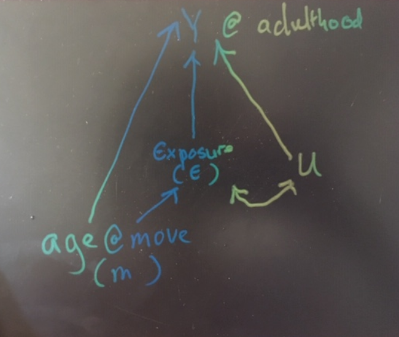
**Note** This is a bit wrong since U is assumed to be correlated with age but time invariant.

**note** would this not imply that we cannot distinguish between age effects and exposure time effects. although empirically it may not matter for interventions.


they assume that moving is tied to confounders but these confounders are not correlated with age of child -- essentially it looks like they are time invariant.(over the ages of childhood)


so at age 13, the same decisions to move are at age 18. the biased regression coef is constant. The difference in age 13 and 18 is exposure time to neighbourhood (well potentially)

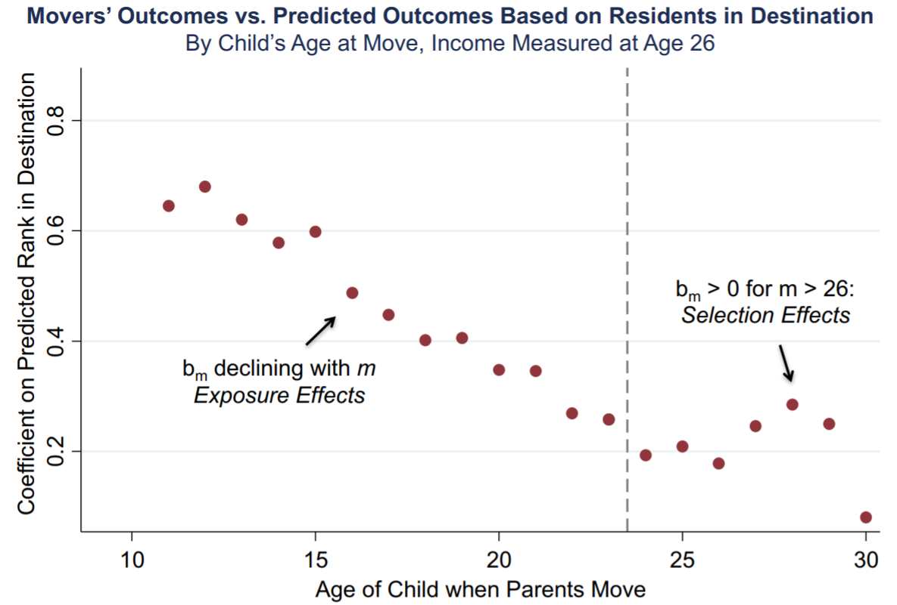


Evidence = The observational data fits the prediction

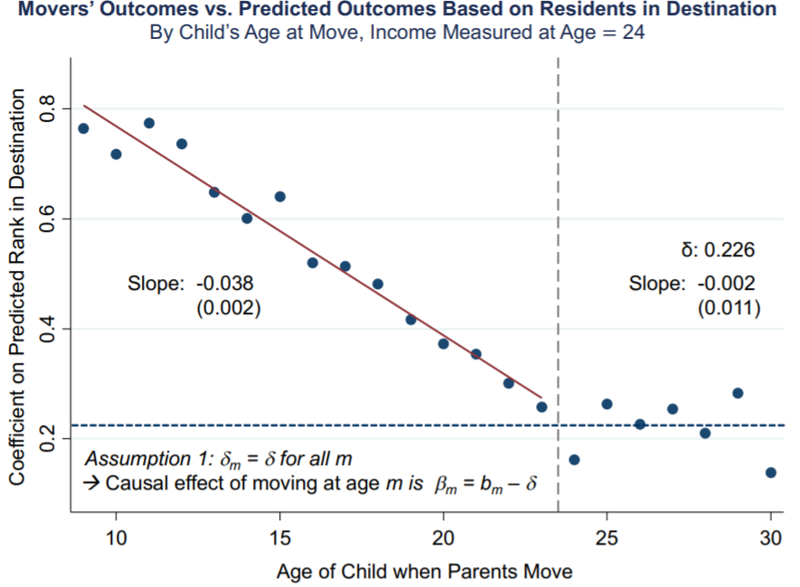

THEN you can use siblings with family fixed effects to partial out some known time invariant factors:

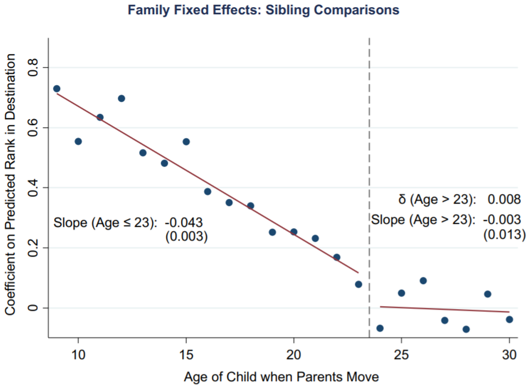

They also find similar exposure effects for other outcomes.

## Summary of robustness tests

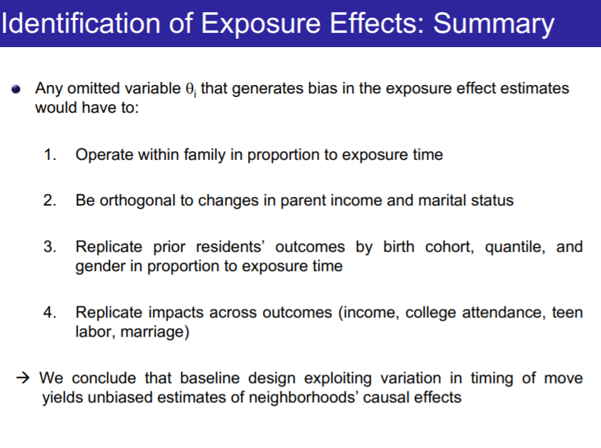

1 = family fixed effect tests
2 = dunno did they simply test timing of move and relationshipe to parental income/ marital status

Additionally they compared to quasi-experiments -- namely natural experiments plus mto

**Time varying confounders**

So address time varying confounders. The placebo overidentificaiton tests and quasi-experiments due to natural disasters.

Their placebo test is based on outcomes: I really ought to understand it better and may be related to cross lag regression.

**mto comparison**


Basically seems to amount to seeing whether there is a similar slope present for the mto sample (which there is). Don't know if there are actually direct within study comparisons.

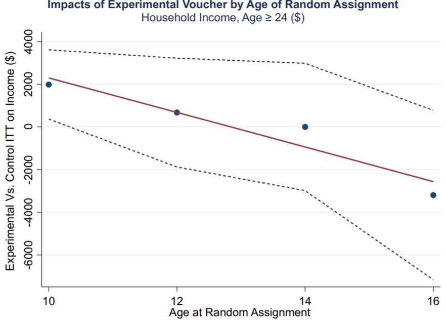

Look at how crazy the SE are though. If the SE are for each poin then we are really omly sure that exposure at age 10 has an effect. They say below age of 13.

Obviously they are aware of the difference in causal interpretation:
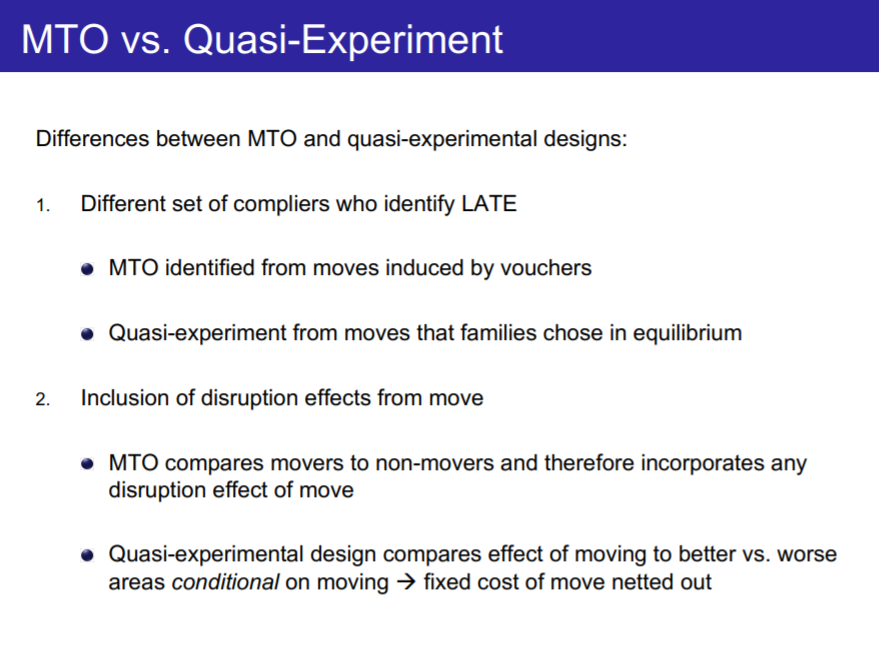


----
# The effect of moving during childhood on long run income (Heidrich 2016)

> Heidrich, S. (2016) ‘The effect of moving during childhood on long run income: Evidence from Swedish Register data’, p. 31.

^ note: PHD paper 3?
note: use SIMSAM data although urban doesn't know here

> In this paper I study the long-term effects of inter-municipal moving during childhood
on income using Swedish register data. Due to the richness of the data I am able to control
for important sources of selection into moving, such as parent separation, parents’ unemployment, education, long run income, and immigration background. I find that children’s
long run incomes are significantly negatively affected by moving during childhood, and the
effect is larger for those who move more often. For children who move once, I also estimate the effect of the timing and the quality of the move. I measure the quality of each
neighborhood based on the adult outcomes for individuals who never move; the quality of
a move follows as the difference in quality between the origin and the destination. Given
that a family moves, I find that the negative effect of childhood moving on adult income is
increasing in age at move. Children benefit economically from the quality of the region they
move to only if they move before age 12 (sons) and age 16 (daughters).


Paper is split into two parts: part 1 looks at children who move during childhood but not timing. _part 2_ looks at the timing.

The main models are in part 3.


## Part 1: Children who move

_p.5. bias_ she mentioned the bias in coef -- but she has multiple variables in $X$ and I'm not sure it works like that -- you have to do it step by step from what i remember in my phd?? Could be wrong

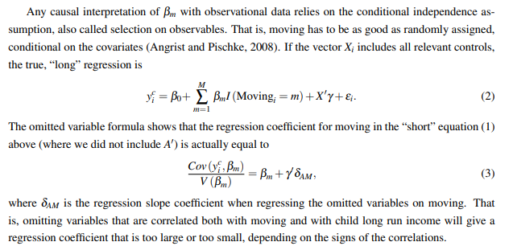

sample
- children born in Sweden

p. 5-6 They show the basic model above and use some covariates. Subset regression by gender.
just tons of covariates.

that's it methodwise

## Part 2: Timing of children who mive

Absolutely NOT based on Chetty and Hendren 2018.

_p.6_ and _p8_ sample:
- children born in sweden between 1968 and 1976
- moved once ONLY
- a sample of stayer is used for model estimation (see below)
- no adopted children


_p.6 - 7_ her steps are a bit all over the place --

step 1a: for region R estimate a regression of stayers -- save this models

step 1b: use model of stayers in step 1 to predict the wages of child who moved FROM R.
This is _in theory_ their predicted wages
_^note_ this absolutely wrong -- we ought to expect bias

step 1c: do the same to predict wages of children who moved TO R

step 1d: work out the difference in predicted wages between origin and destiniation
_^note_ I assume that in the chetty and hendren paper this was based on they assume that the bias term in these regression cancel each other out.

step 2: Ah now she estimates a ols model similar to chetty and hendren -- instead of a subgroup regressions she uses interaction terms. Her regressions are poorly explained.

p.7
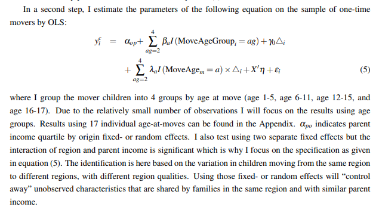

_note_ that she talks about low sample sizes which need grouping -- check this.
_note_ $X$ here is a bunch of control vars

_p.8. outcome_ = averged incomes ages 32 - 34. parents income is ave between 34 - 50.
_p.8. income ranks_ she also uses income ranks as an additional result

_p.8._ women can take maternity leave during this time and their earned benefits are capped!
> A large proportion of the daughters in my data (around 40 percent in each cohort) receives maternity
leave benefits during the years I measure adult incomes. Due to the cap on this earnings-based transfer
as well as the flexible ways to take out the benefits there is significantly more measurement error in the
daughters long run income compared to the sons which we need to keep in mind during the analysis.

_p.11_ municiaplities change over time so that needs to be considered when calculating stuff:
> The municipality structure in Sweden has undergone many changes since 1970. Many municipalities
have been merged with or broken out of other municipalities, sometimes several times. All original
municipality coding in the data has been carefully revised and updated in order to not wrongfully classify
a change in a municipality code as a move. This has been done using official documentation of the
Swedish municipality reforms from Statistics Sweden. The residence is recorded only once every year
in December, so that the number of moves observed in the data can be seen as a lower limit to the true
number of moves

_p.11 table 2_ shows frequency of moves during childhood (any age?) by municipality aand county

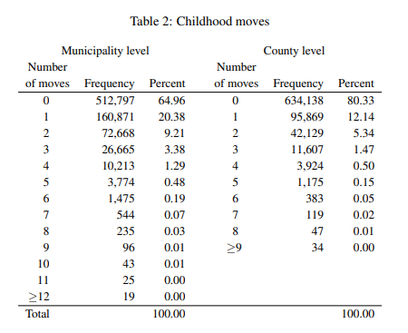

~ 250k moved muni, county is a higher level geography than muni

_4.2. results_

_p.20_ bits highlighted are the nearest equivalent to CH estimators.
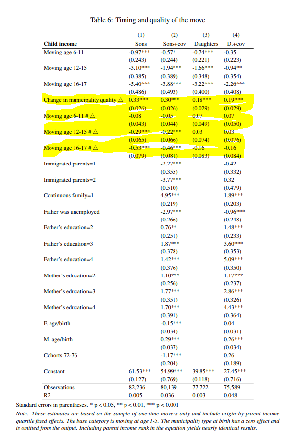

I note that the coefs don't really change so suggests that age of move might not be correlated with other $X$.

_note_ for the second section, She didn't do the full gauntlet of tests.

The graph version
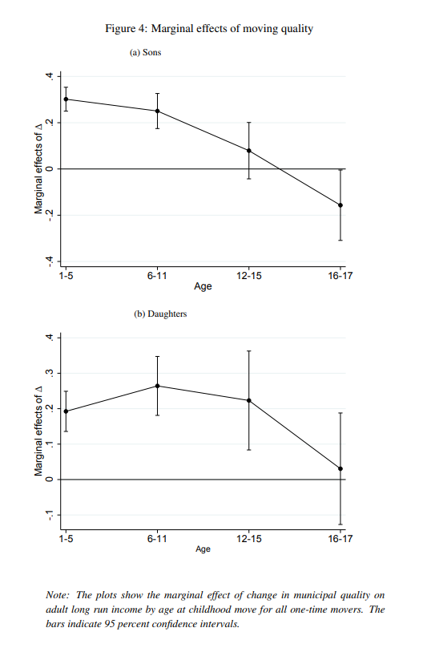

Seems pretty persuasive and relatively similar to Chetty and Hendren.

_note_ unlike chetty and hendren she didn't regress the coef to get the line effect.

The full results by age is actually in the Appendix see table _A.6_

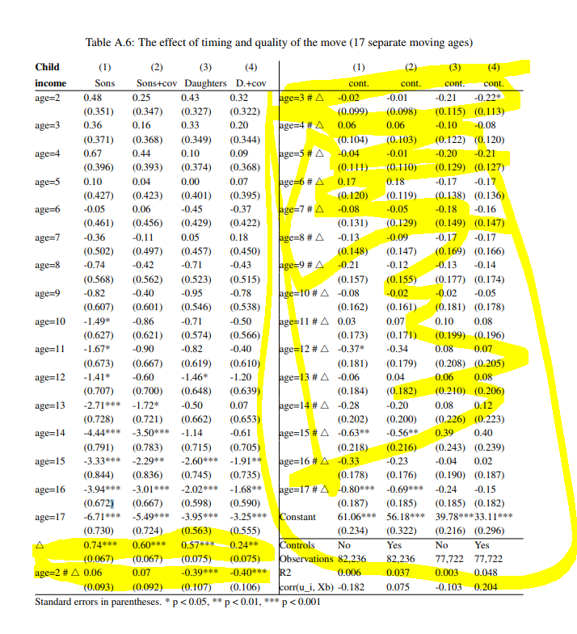

This is the most like C+H's design. We can replot these and regress

The frequency of moves by age:

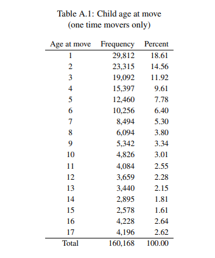

_note_ we can put this through a McCrary test? I think I can see why chetty and hendren picked 10 - 18.

x
